## These slides `r emo::ji("point_right")` [alex-we.in/slides/visfest](https://alex-we.in/slides/visfest)

### Textbook: [Formal Foundations of Linguistic Theory](http://coffeeblack.org/publications/Pollard-Martin-FFLT.pdf) by Pollard and Martin


---

# Thanks!

* Stephanie Tuerk, Tony Chu, and Jason Forrest
* The visfest organizers
* Ohio State Linguistics and Haverford College Math departments
* Data Visualization Society, [vis.social](https://vis.social), and generally everyone in the data viz building the type of community I want to be a part of.
* All of you!


---
background-image: url(images/alexwein-dataperson.png)
background-size: contain

---
#Alex Wein, over-apologizer.

--

# Sorry

---

# Math

1. ### Assumptions
1. ### Definitions
1. ### Inferences

## $=$ &nbsp;&nbsp; vs.&nbsp;&nbsp; $=_{def}$

---

# Set theory is a foundation for the rest of math

1. Define natural numbers in terms of sets
1. Define integers in terms of natural numbers
1. Rational numbers are based on integers
1. Real numbers are constructed from rational numbers.

---
background-image: url(https://uploads-ssl.webflow.com/5b1d427ae0c922e912eda447/5b5679eed1ecea66513ef29d_examples.jpg)
background-size: contain

Credit [Tai-Denai Bradley's What is Category Theory](https://www.math3ma.com/blog/what-is-category-theory-anyway)

---

# This is about Data Viz, right?

1. We'll leverage intuitions about viz to understand set theory.
1. Viz isn't just about the visuals, it's about the mapping from data to visuals.
1. Data and visualization are not programming concepts.
1. Gives us a little bit of machinery to compare different types of data viz.
1. Datasets are sets.


---

# Where we're going: **functions**

1. A function is a special kind of relation
1. A relation is a subset of a cartesian product
1. A cartesian product is a special set of ordered pairs
1. An ordered pair is a special kind of set

#### A function is a special kind of set which is a special kind of set built from a special kind of set of special kinds of sets.

---

# Sets

It's a collection of things.  That's it.

Sets are defined solely in terms of membership. Given any two sets $A$ and $B$, either:

$A \in B$ or $A \notin B$.

$\in$ means "is in" or "is a member of"

$\notin$ means "is not in"

---

# Assumptions for Set Theory

1. Extensionality
1. Empty Set
1. Pairing
1. Union
1. Powerset
1. Separation

* We'll cover the above, but there are a few more to get to the fully standard [Zermelo-Fraenkel Choice (**ZFC**)](https://en.wikipedia.org/wiki/Zermelo–Fraenkel_set_theory):

1. Natural Numbers
1. Replacement
1. Foundation
1. Choice

--

# Also, we're skipping over a lot of formalism.

---

# Assumption 1 - Extensionality

## We need to define equality.

--

## Two sets are "the Same" if they have the same members ( $A = B$ )

$\{a, b, c\}  = \{b, a, c\}  = \{a,a,a, b , c\}$

Order doesn't matter, uniqueness is baked into the definition.

---

# Extensional and Intensional Meaning

1. Woodchucks and groundhogs
1. Extensional meaning is shallow and doesn't completely cover how language works.
1. Extensional meaning *does* map really nicely with relational data.

---

# Subset: $A \subseteq B$

We say "A is a subset of B" if every element of A is an element of B.

$A \subseteq A$ for any set A.

If $A \subseteq B$ and $B \subseteq C$, then $A \subseteq C$.

Given two sets, either the first is a subset of the second or its not!

If "A is not a subset of B" ( $A	\nsubseteq B$ ), that means there's some element $b \in B$ where $b \notin A$.

---
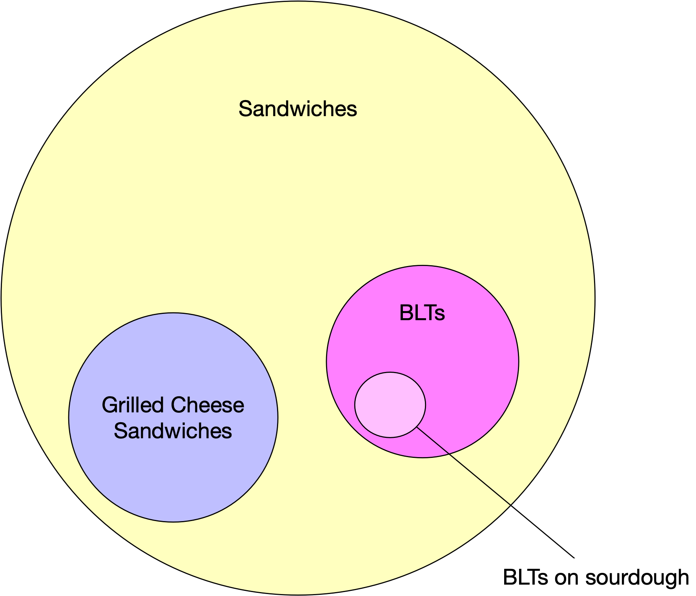

---

# Assumption 2 -  Empty Set $\varnothing$

Set membership and extensionality don't actually give us any sets.  We need to give ourselves a starting point.

Let's assume there exists a set containing no elements.  We can denote it as $\{\}$, but it's helpful to give the empty set its own symbol $\varnothing$.

**Vacuous Quantification** - when you have a definition based on "every member of a set", it's going to be true for the empty set. For instance, $\varnothing$ is a subset of every other set.

---

# Assumption 3 - Pairing $\{ A, B \}$

Given two sets A and B, we can construct a set with just those two elements.


**Singleton**: special case when $A = B$...pairing gives us  $\{A, A\} = \{A\}$

---

# Infinite Sets from Nothing

1. Assumption 2 gave us exactly one set to build with: $\varnothing$.
1. Let's apply pairing to construct a new (different) set $\{\varnothing\}$. These are not the same set!
1. Now we have two sets.
  1. We can now pair $\{\varnothing\}$ with itself to get $\{\{\varnothing\}\}$
  1. Or we can pair $\{\varnothing\}$ with $\varnothing$ to get $\{\varnothing,\{\varnothing\}\}$.
1. We can go on and on like that forever.


---

# Assumption 4 - Union: $\bigcup A$

Given a set $A$, there's a set containing every element of every element of $A$.

--


Example:

$$ X = \\{a,b,c\\} $$
$$ Y = \\{c,d,e\\}$$
$$ Z = \\{f\\}$$

Then $\bigcup \{X,Y,Z\}$ is equal to

$$ \\{ a,b,c,d,e,f \\} $$
--

## The binary syntax is helpful syntax:

# $A \cup B =_{def} \bigcup \{A,B\}$ 

---

# Assumption 5 -  Powerset: $P(A)$

For any set A, there's a sets whose members are the subsets of A.

So, no matter what A is, we know $\varnothing \in P(A)$ and $A \in P(A)$

---
class: center, middle

Consider $A = \{a,b,c,d\}$:

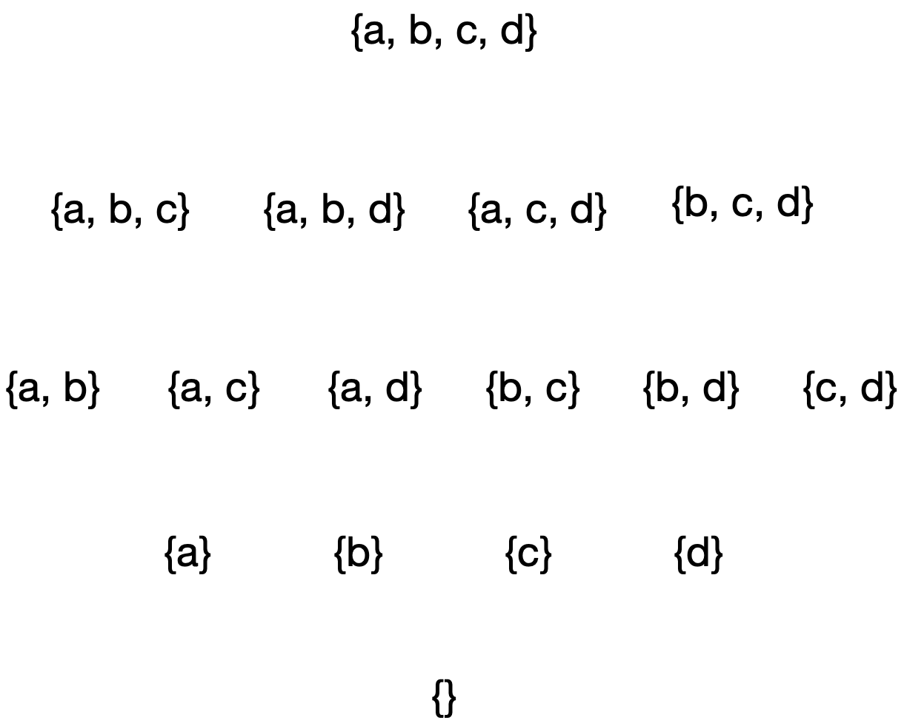
---
class: center, middle

Consider $A = \{a,b,c,d\}$:

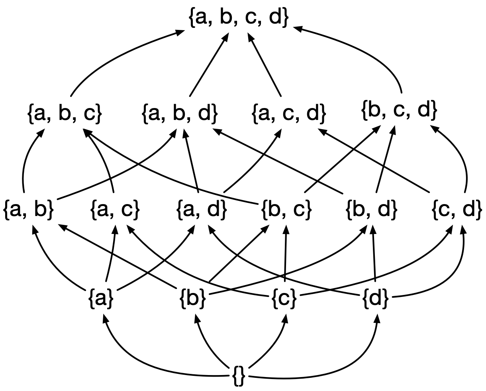

---

# Bertrand Russell's Paradox

--

## Everyone in town shaves. 

--

##The barber shaves everyone who doesn't shave themself, and nobody else.

--

## Does the barber shave himself?  
--
`r emo::ji("thinking_face")`


---
# Assumption 6 - Separation

If $A$ is a set and $P[x]$ is a condition on $x$ (where $x$ is a variable that ranges over sets), then there is a set, written

# $\{ x \in A \,|\, P[x]\}$

whose members are all the x in A that satisfy P[x].

The $|$ symbol can be read as "such that".


---

# Intersection $A \cap B$

Given two sets $A$ and $B$.

# $A \cap B =_{def} \{a \in A |\, a \in B\}$

We don't need to assume intersection, because it is a special case of separation.


1. $A \cap B = B \cap A$
1. If $A \subseteq B$, then $A \cap B = A$
1. $A \cap \varnothing = \varnothing$
1. we say that A and B are **disjoint** if $A \cap B = \varnothing$


---

## Ordered Pairs $\langle A, B \rangle$

1. Sets don't have order to them $\{ A, B \} = \{ B, A \}$.
1. But we want a way to talk about order.
1. If $A \neq B$, then we want $\langle A, B \rangle \neq \langle B, A \rangle$

--

## Definition of an ordered pair

# $\langle A, B \rangle = \{\{A\}, \{A,B\}\}$


This is built out 3 applications of the pairing assumption.

---

# Cartesian Product, $A \times B$

The set of all ordered pairs $\langle a, b\rangle$ such that $a \in A$ and $b \in B$.

---
```{r, echo = FALSE, message = FALSE}
library(dplyr)
library(ggplot2)
A <- c("p", "q", "r")
B <- c("x", "y", "z")
AxB <- tidyr::crossing(A,B)

AxB %>%
  mutate(pair = paste0("{", A, ", ", B, "}")) %>%
  ggplot(aes(x = A, y = B, label = pair)) +
  geom_text(size = 10) +
  theme_bw() +
  ggtitle("A x B") +
  theme(axis.title = element_text(size = 20),
        axis.text = element_text(size = 20),
        plot.title = element_text(size = 25))
```

---

# More dimensions.

1. We have ordered pairs. How about triplets.
1. # $\langle a,b,c \rangle =_{def} \langle \langle a, b \rangle, b \rangle$
1. ##  $A \times B \times C =_{def} (A \times B) \times C$
1. Generally n-tuples and as an ordered pair of an (n-1)-tuple and another element.

---

# Relations!

## Simple definition; really powerful concept

--

## A Relation $R$ between $A$ and $B$ is a subset of $A \times B$.

### We can use the notation $a\,R\,b$ to mean $\langle a,b \rangle \in R$


Important special case $B = A$, then we have a relation **on** A.

---

## Relations in the real world

1. loves
1. ate for dinner
1. is taller than
1. is at least as tall as
1. is the parent child
1. is the ancestor of
1. is the brother-in-law of
1. has more privilege than ([from Category Theory in Life](https://www.youtube.com/watch?v=ho7oagHeqNc) - Eugenia Cheng)
1. is friends with
1, is facebook friends with
1. Verbs that relate people to propositions
  * believes, knows, doubts

---

## Representing Relations: Using set notation

# HadForDinner =

$$
\\{
\langle Amir, Pasta \rangle,
\langle Beatrice, PorkChop \rangle,
\langle Carlos, PorkChop \rangle,
\langle\ Carlos, Salad \rangle
\\}
$$

---

## Representing Relations: As a table.

```{r, echo = FALSE, message=FALSE}
HadForDinner <- tibble(
 person = c("Amir", "Beatrice", "Carlos", "Carlos"),
 food = c("Pasta", "PorkChop", "PorkChop", "Salad")
)
knitr::kable(HadForDinner,format='html')
```

---

## Representing Relations: As a grid

```{r, echo = FALSE, fig.height = 5}
library(ggplot2)
ggplot(HadForDinner, aes(x = person, y = food)) +
  geom_point(size = 4) +
  ggtitle("{person} had {food} for dinner") +
    theme(axis.title = element_text(size = 20),
        axis.text = element_text(size = 20),
        plot.title = element_text(size = 25))
```

---
## Order doesn't matter for sets.

### These are equivalent:

.pull-left[
```{r, echo = FALSE}
 ggplot(HadForDinner, aes(x = person, y = food)) +
 geom_point(size = 4) +
 theme(axis.title = element_text(size = 20),
        axis.text = element_text(size = 20),
        plot.title = element_text(size = 25))
```
]

.pull-right[
```{r, echo = FALSE}
HadForDinner %>%
  mutate(person = factor(person, levels = c("Beatrice", "Carlos", "Amir")),
         food = factor(food, levels = c("PorkChop", "Pasta", "Salad"))) %>%
  ggplot(aes(x = person, y = food)) + geom_point(size = 4) +
   theme(axis.title = element_text(size = 20),
        axis.text = element_text(size = 20),
        plot.title = element_text(size = 25))
```
]


---
## Representing Relations: using nodes and edges

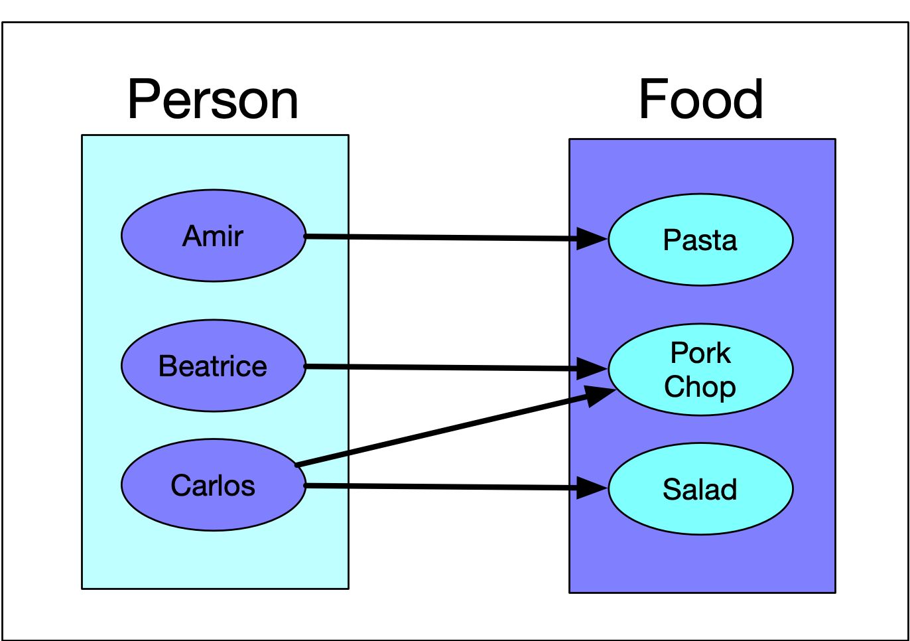


---
# Identity Relation on a set $A$

# $id_A = \{\langle x,y \rangle \in A \times A | \, x = y \}$

--
<hr>

.pull-left[


]

.pull-right[

```{r, echo = FALSE, fig.height = 5}
A <- tibble(el = c("a", "b", "c", "d", "e"))
ggplot(A, aes(x = el, y = el)) +
  geom_point(size = 6) +
    theme(axis.title = element_text(size = 15),
        axis.text = element_text(size = 35))

```

$\{\langle a,a \rangle, \langle b,b \rangle, \langle c,c \rangle, \langle d,d \rangle, \langle e,e \rangle\}$

]
---


## Domain and Range

## Given a relation $R$ from $A$ to $B$

1. ## $dom(R) = \{ x \in A \,|\, \exists y \in B (x \,R\, y)\}$
1. ## $ran(R) = \{ y \in B \,|\, \exists x \in B (x \,R\, y)\}$

$\exists$ reads as "there exists".

---

# Inverse Relation: $R^{-1}$

 $R^{-1} =_{def} \{ \langle x,y \rangle \,|\, y \,R\, x\}$

If a relation $R$ is a subet of $A \times B$, its inverse $R^{-1}$ is the subset of $B \times A$ obtained by swapping the order of the pairs (reversing the arrows).

---

# $HadForDinner^{-1}$

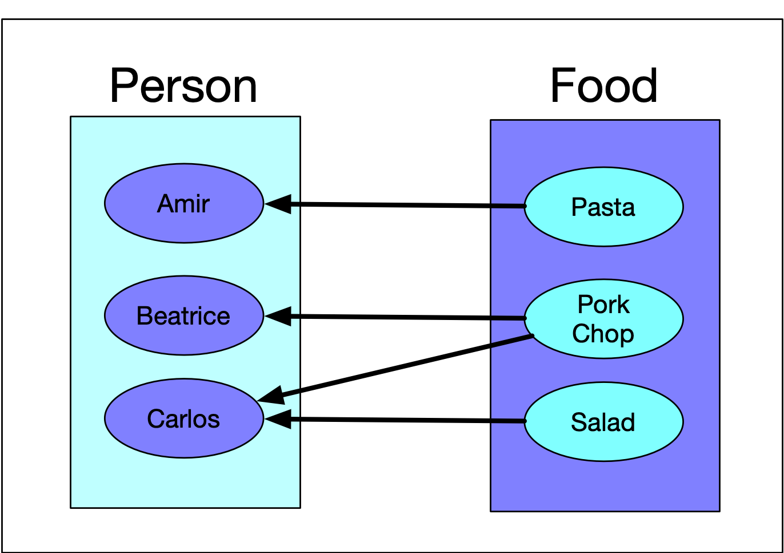

---

# Examples of inverse relations:

1. is greater than; is less than
1. loves; is loved by (passive voice more generally)
1. is the parent of; is the child of
1. is the sibling of; is the sibling of

---
# Composition

Given two relations, we can combine them: Since they're just sets, we can union them together or take their intersection, but we can also compose them:

Given R is a relation from A to B,Given S is a relation from B to C, then


### $S \circ R =_{def} \{ \langle x,z \rangle \in A \times C \,|\, \exists y \in B (x\,R\,y \wedge y\,S\,z)\}$

* The subset of pairs $\langle x,z \rangle$ in $A \times C$ where "there exists a $y$" ( $\exists y$ ) such that x is related to Y through R, *and* ( $\wedge$ ) y is related to z through S.
* Note the order $S \circ R$: $S$ happens after $R$.

---
background-image: url(images/relation-composition.png)
background_size: contain

---

Examples of relation compostion:

1. is the grandfather of = is the father of the father of.
1. is the brother-in-law of
1. function composition:
  1. If we have $f(x) = x^2$ and $g(x) = x + 2$
  1. $g(f(x)) = x^2 + 2$
  1. $f(g(x)) = (x+2)^2$ 


---

# Special Properties of Relations on A

1. Reflexive
1. Symmetric
1. Transitive

---

A relation $R$ on $A$ is **reflexive** if $x\,R\,x$ for all $x \in A$.

* Equivalent definition: $id_A \subseteq R$

A relation is **irreflexive** if $\langle x , x \rangle \notin R$ for all $x \in A$.

* Equivalent defintion: $id_A \cap R = \varnothing$

<br />
<br />


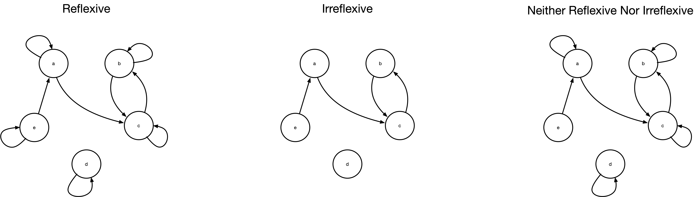

--

What's do reflexive relations look like as grids?

---

A relation $R$ on $A$ is **symmetric** if $a\,R\,b$ implies $a \,R\, b$ for all $a,b \in A$.

* Equivalently, $R = R^{-1}$

A relation is **asymmetric** if $a\,R\,b$ implies $\langle a, b \rangle \notin R$ for all $a,b \in A$.

* Equivalently, $R \cap R^{-1} = \varnothing$

A relation is **antisymmetric** if $a\,R\,b$ and $a\,R\,b$ imply $a = b$ for all $a,b \in A$

* A relation is asymmetric if it is antisymmetric and irreflexive.

<br /><br />
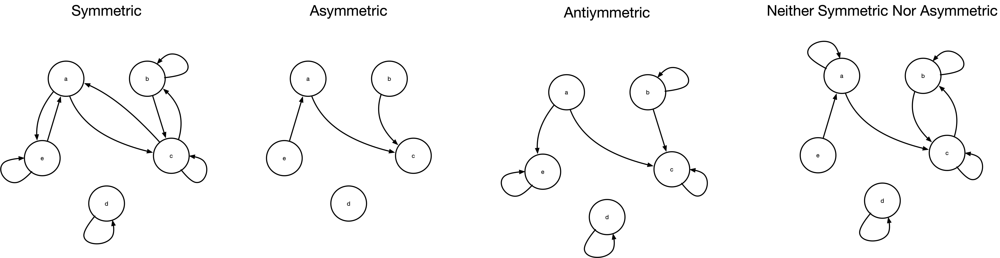
--

What does a symmetric relation look like as a grid?

---

A relation is **transitive** if $a\,R\,b$ and $b\,R\,c$ implies $a\,R\,c$ for all $a,b,c \in A$.

* Equivalently: $R \circ R \subseteq R$

A relation is **intransitive** if $a\,R\,b$ and $b\,R\,c$ implies $\langle a,c \rangle \notin R$ for all $a,b,c \in A$.

<br /><br />
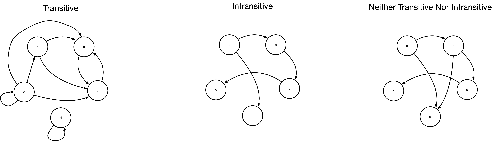
---
# A few more special relations

<br /><br />
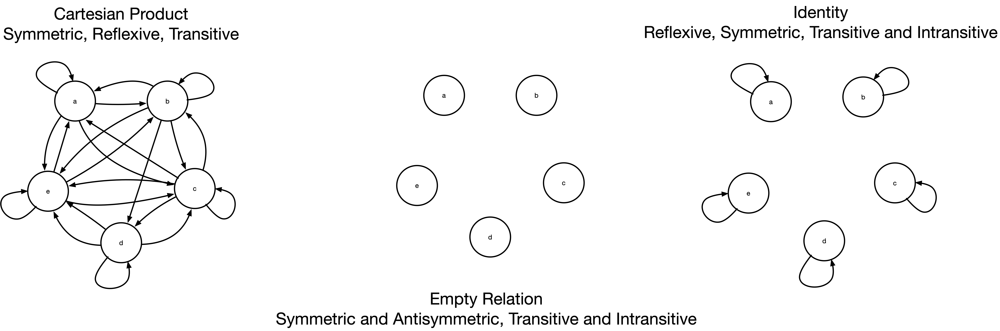
---
# **Equivalence Relation**

A relation is an equivalence relation if it is reflexive, symmetric, and transitive.

We can use a hamburger: $a \equiv b$ reads as "a is equivalent to b"

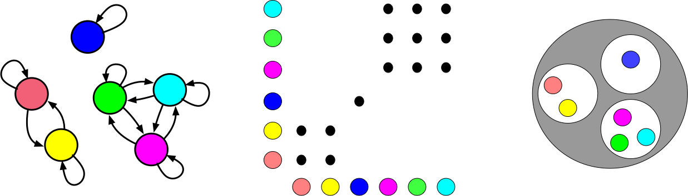

An equivlance relation on A partitions A into disjoint subsets.

---

# Functions (we made it!)

A relation $F$ is called a function from A to B, provided for every $a\in A$ there exists a unique $b \in B$ such that $a\,F\,b$.

1. Notation: $F(a) = b$ "b is the value of F at a"
1. or: $F: a \rightarrow b$ "F maps a to b"

1. $A$ is the **domain** of $F$.
1. $B$ is the **codomain** of $F$.
1. The **range** of $F$ is $\{b \in B \,|\, \exists a(F(a) = b)\}$

---
class: center, middle

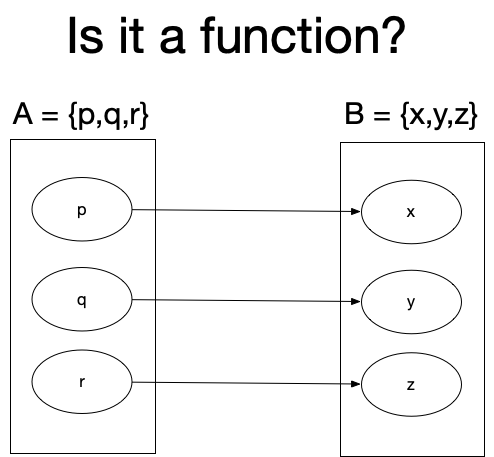

---
class: center, middle

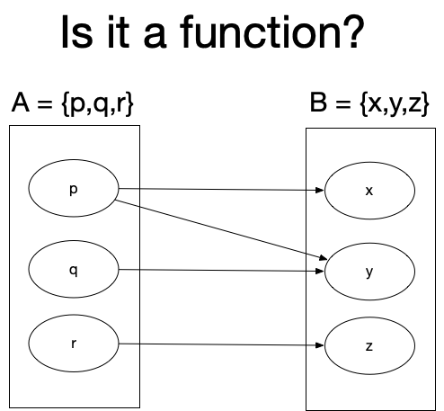

---
class: center, middle


---
class: center, middle

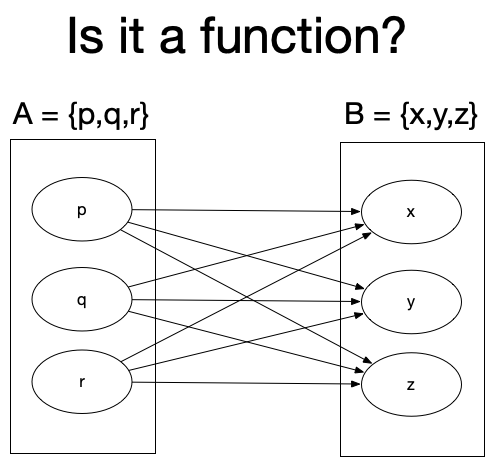

---
class: center, middle

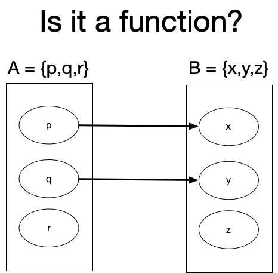


---
class: center, middle

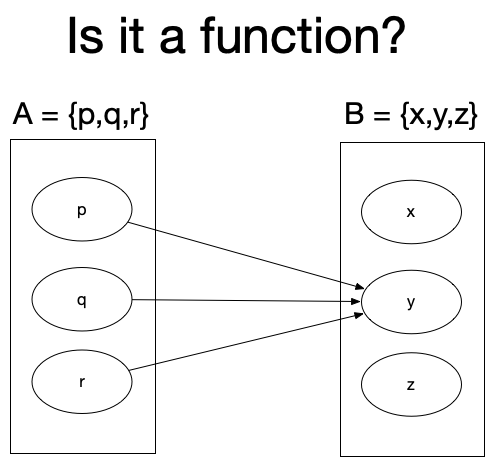

---

## Do you remember the vertical line test?

```{r, echo = FALSE}
"frame,A,B
1, p,x
1, q,y
1, r,z
2, p,x
2, q,y
2, r,z
2, p,y
3,,
4, p,x
4, p,y
4, p,z
4, q,x
4, q,y
4, q,z
4, r,x
4, r,y
4, r,z
5, p,x
5, q,y
6, p,y
6, q,y
6, r,y
" %>%
  readr::read_csv() %>%
  mutate(frame = as.factor(frame)) %>%
  filter(!is.na(A)) %>%
  ggplot(aes(x = A, y = B)) +
  facet_wrap(~frame, drop = FALSE) +
  geom_point(size = 5) +
  ggtitle("A = {p,q,r};   B = {z,y,z}") +
  theme_bw() +
  theme(axis.title = element_text(size = 20),
        axis.text = element_text(size = 20),
        plot.title = element_text(size = 25))
```

---
# Is it a function?

--
1. ## is friends with 
--

1. ## is the boss of
--

1. ## is the mother of
--

1. ## is married to
--

1. ## A = passengers on a airline flight, B = seats on the airplane

---
# Is it a function?

--

1. ## $y = 4x^2 - 3x + 4$
--

1. ## $x^2 + y^2 = 1$
--

1. ## $y = log(x)$
--

1. ### `message => console.log(message)`
--

1. ### `x => x + Math.rand()`


---

.pull-left[
### For any function $f: A \rightarrow B$, there exists an equivalence relation $\equiv_f$ where $a \equiv b$ if $f(a) = f(b)$
]
.pull-right[
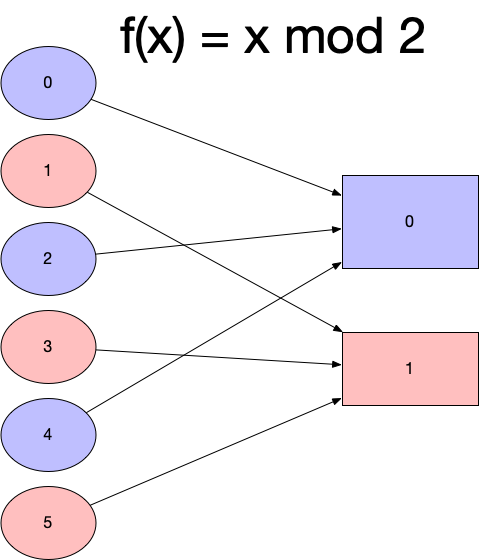
]
---

# One to One: Injective

* If $\langle a, b, \rangle \in F$, then $a = b$.  


# Onto: Surjective

* $ran(F) = B$


# Bijective: one-to-one and onto

* If $F: A \rightarrow B$ is a bijective function, then $f^{-1}$ is also a bijective function.
* If f isn't bijective, it's inverse is not a function.

---

# Functional Programming

1. Pure Functions
  1. Don't affect input
  1. Don't have any other side effects
  1. Are deterministic: same input yield same output
1. Higher Order Functions
  - functions that take functions as input
  - functions that return functions as output

---

# Functional Programming with Data

1. Unchanging source of truth
1. All the functions in statistics are math functions, not computer functions.
1. You don't watch the act of observation affect the system.
1. Deterministic functions means reproducibility


--

1. Hadley Wickham: [Joy of Functional Programming (for Data Science)](https://www.youtube.com/watch?v=bzUmK0Y07ck)
1. Maxime Beauchemin: [Functional Data Engineering - a modern paradigm for batch data processing](https://medium.com/@maximebeauchemin/functional-data-engineering-a-modern-paradigm-for-batch-data-processing-2327ec32c42a)
1. Michael Arntzenius: [DB ⋈ FP = Datafun: a new functional query language](https://www.youtube.com/watch?v=7HUotKIVFig)


